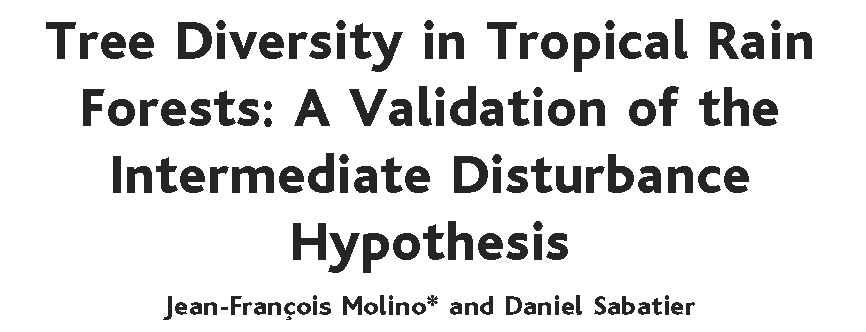
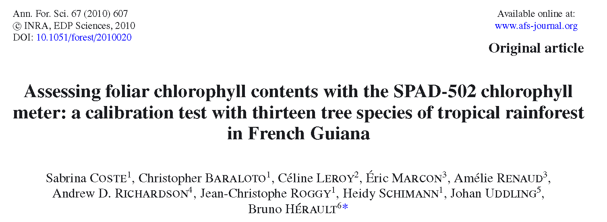

```{r setup, include=FALSE}
knitr::opts_chunk$set(echo = TRUE, tidy=TRUE, tidy.opts=list(blank=FALSE, width.cutoff=50))
options(width=50)
# Install necessary packages only
InstallPackages <- function(Packages) {
  sapply(Packages, function(Package) 
    if (!Package %in% installed.packages()[, 1]) install.packages(Package))
}
# InstallPackages(c("devEMF"))
```


# Généralités

## Motivation

- Publier pour faire connaître son travail ;

- Rédiger pour conclure sa recherche ;

- Elément essentiel de l'évaluation des chercheurs ;

- Enorme investissement financier.


## Types de publications

- Article IMRD :

    - Le plus courant : publication de résultats ;
    
    - Plan-type : Introduction, Matériel et Méthodes, Résultats, Discussion.
    
- Revue :

    - État de l'art de la littérature ;
    
    - Pas de résultats nouveaux mais un point de vue ;
    
    - Plan plus libre.
    

## Types de journaux

- Disciplinaires : spécialisés dans un domaine de la recherche

    - Tree physiology, Methods in Ecology and Evolution.

- Généralistes : audience plus large

    - Ecology Letters, TRENDS, PNAS.

- Hebdomadaires : "grand public", très large audience

    - Nature, Science.
    
Format différent dans les hebdomadaires : pas de plan formalisé, méthodes en annexe.


## Comment rédiger

Points importants pour la rédaction de chaque partie.

Les parties sont vues dans l'ordre logique, pas celui de l'article.

Cette section s'appuie sur @Lindsay2011.


# Résultats

## Contenu

\begincols
  \begincol{.6\textwidth}


La réponse factuelle à la question de recherche.

Les résultats vont influer sur l'introduction, à écrire après.

Les résultats préparent la discussion.

Exemple : @Molino2001.

  \endcol
  \begincol{.4\textwidth}
  
```{r Molino2001, echo=FALSE, out.width='70%'}

```

  \endcol
\endcols


## Types de résultats

1. Convaincants, pertinents ;

1. Pertinents mais pas convaincants ;

1. Convaincants mais pas pertinents ;

1. Ni pertinents, ni convaincants.


Présenter les résultats de type 1, puis 2. Les résultats négatifs sont importants.

Les résultats de type 3 amènent normalement un autre article.

Les résultats de type 4 sont à oublier.


## Présentation

Commencer par le résultat majeur :

- Le décrire dans le texte ;

- L'illustrer par une figure. Eviter les tableaux.


S'il y a plusieurs résultats :

- Faut-il en faire plusieurs articles ?

    - Non s'ils sont complémentaires ;
    
    - Oui sinon. Le lecteur ne peut retenir qu'un seul message.

- Les organiser: du général au particulier.


## Forme

- Toute figure doit être autosuffisante :

    - Totalement décrite par sa légende ;
    
    - Pas de titre, pas de cartouche sur la figure.
    
- Eviter toute redondance entre le texte et la figure ;

- Ne pas multiplier les figures :

    - place limitée ;
    
    - un seul message.

- Eviter les énumérations: les résultats peuvent être pénibles à lire.


# Discussion


## Contenu

```{r Coste2010, echo=FALSE, out.width='70%'}

```

Exemple : @Coste2010b.

L'interprétation des résultats.

Leur comparaison à l'état de l'art.

Leurs implications.


## Présentation

Raconter une histoire :

- Commencer par un plan, qui est une liste d'arguments rédigés ;

- La discussion doit commencer par les points les plus importants (ce n'est pas un roman policier) ;

- Le volume de chaque argument est en conséquence de son importance.


## Forme

La discussion fonctionne par paragraphes.

- une phrase thématique :

    - Introduit l'argument ou, mieux, synthétise l'argument.

- un développement ;

- une phrase de conclusion :

    - synthèse si la phrase thématique est une simple introduction; implications sinon.

Si le développement est trop long ou complexe, organiser la discussion en sous-sections dont les titres sont les phrases thématiques.


## Forme

- Ne pas répéter les résultats ;

- S'appuyer sur la littérature (qu'il faut connaître !) :

    - pour éviter de rediscuter ;
    
    - pour appuyer son point de vue ;
    
    - pour montrer la nouveauté des résultats en la contredisant.
    
- On peut spéculer en le justifiant mais on ne peut pas généraliser au-delà de ce qu'on a montré.


# Introduction

## Contenu

L'introduction pose la question scientifique.

## Présentation

- Quelques phrases de présentation du contexte. Enjeux : quelles sont les questions larges sur le sujet ? Pas toujours utile si non traité dans la discussion.

- Problématique : quelle est la contribution de l'article à ces questions ? Bref état de l'art : la discussion complètera la revue de la littérature, se limiter aux références les plus importantes.

- Énoncé de l'hypothèse de l'article : la question précise, à laquelle les résultats répondent directement.

- Si la conclusion est simple, il est possible de la présenter ici brièvement.

- Si le plan n'est pas IMRD, le présenter.


## Forme

L'introduction doit être percutante : la majorité des lecteurs s'arrêtera là sinon.

Elle doit être courte.


# Matériels et méthodes


## Contenu

La section doit permettre au lecteur de comprendre exactement ce qui a été fait et comment.

Idéalement, elle permet la reproduction des résultats.

Elle peut être écrite pendant la phase expérimentale qu'elle décrit.

## Présentation

Dépend de la partie expérimentale

Aller du général au particulier, par exemple :

- plan d'expérience ;

- matériel végétal et technique utilisé ;

- conditions de l'expérience, protocole détaillé.


## Forme

L'information doit être détaillée, pour la reproductibilité :

- localisation géographique ;

- marque des équipements utilisés ;

- nom et version des logiciels utilisés ;

- ...


# Résumé

## Contenu

Résumé complet et autosuffisant de l'article.

Enjeu énorme : la majorité des lecteurs ne lira que le résumé.


## Présentation

4 éléments:

- Pourquoi l'article a été écrit ;

- Comment la question a été traitée ;

- Les résultats principaux ;

- Leur implication (la conclusion).


# Matériel supplémentaire

## Pourquoi

Annexes à l'article :

- Détails des méthodes, démonstrations mathématiques...

- Figures secondaires mais intéressantes ;

- Données ;

- Multimedia.


## Comment

Le format dépend de la revue. En général, PDF.

Pas d'édition : responsabilité totale des auteurs.

Attention au référencement dans l'article, généralement très formel.


# Préparation à la soumission

## Liste des auteurs

- Conditions pour être auteur ;

- Premier et dernier auteur ; 

- Déclaration des contributions.


## Formatage

- Premier envoi en général en PDF ;

- Format \LaTeX ou Word après acceptation ;

- Instructions aux auteurs :

  - Format du texte ;
  
  - Format de la bibliographie.


# Références

## Bibliographie
